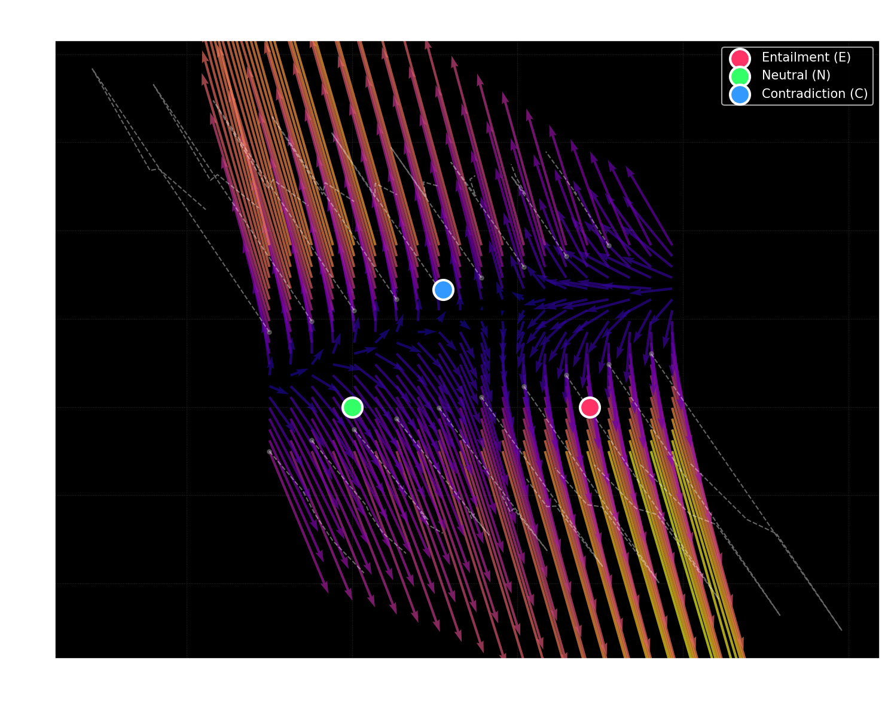
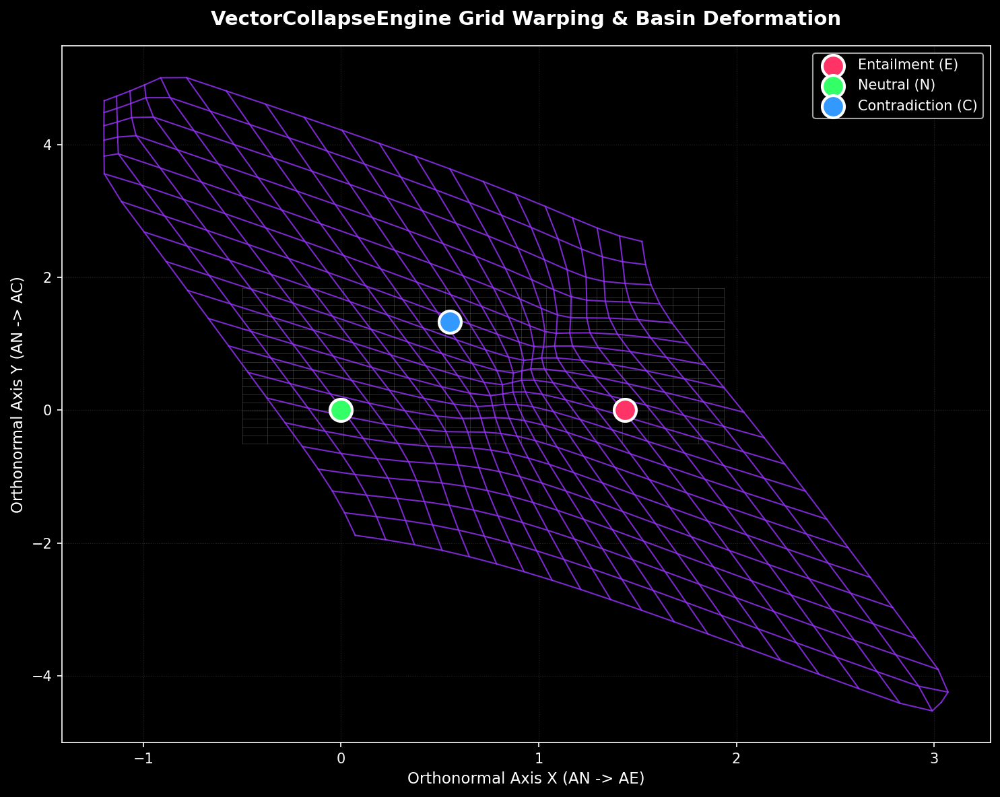

# VectorCollapseEngine Attractor & Warping Field Visualization

We projected the 256-dimensional space of the trained supervised collapse model onto a 2D plane spanned by the three unit-normalized class anchors. The origin $(0, 0)$ is centered at the **Neutral (N)** anchor, the x-axis points directly toward **Entailment (E)**, and the y-axis represents the orthogonal component pointing toward **Contradiction (C)**.

Here are the 2D coordinates of the anchors on this projection plane:
- **Neutral (N)**: $(0.00, 0.00)$
- **Entailment (E)**: $(1.44, 0.00)$
- **Contradiction (C)**: $(0.55, 1.33)$

---

## 1. Vector Flow Field (Quiver Plot)

This plot shows how the representation space flows through the 4 layers of the `VectorCollapseEngine`. Each arrow represents the displacement of a point from its initial coordinates (at layer 0) to its final position (at layer 4). The color indicates the speed/magnitude of the warping.

### Key Observations:
- **Gravity Wells**: The vector arrows converge directly onto the three anchor circles.
- **Velocity Profiles**: The arrows are longer (brighter colors) in the regions between anchors, indicating strong thermodynamic force pulling vectors into the nearest attractor basin.
- **Curvature**: The dashed lines trace the trajectories of sample points. Notice that their paths curve dynamically rather than traveling in straight lines, demonstrating the influence of the non-linear MLP updates ($\delta$) combined with the anchor attraction forces.

---

## 2. Grid Warping & Basin Deformation

This plot shows how a uniform grid of coordinates (gray grid lines) is physically distorted (purple grid lines) after passing through the 4 layers of the collapse engine.

### Key Observations:
- **Pinching/Contraction**: Notice how the purple grid lines are "squeezed" and densely packed around the **Entailment**, **Neutral**, and **Contradiction** anchors. 
- **Basin Boundaries**: The space between the anchors is stretched thin, acting as a ridge that divides the attractor basins. Any vector landing on one side of the ridge collapses into E, while the other side collapses into C or N. This creates a clean, robust decision boundary.
- **Interpretation**: This warping physically clusters semantic representations. By contracting the grid, the model forces different sentences with similar semantic implications (e.g. synonyms or entailment relationships) to contract to the same point-attractor, making classification simple, robust, and highly structured.
